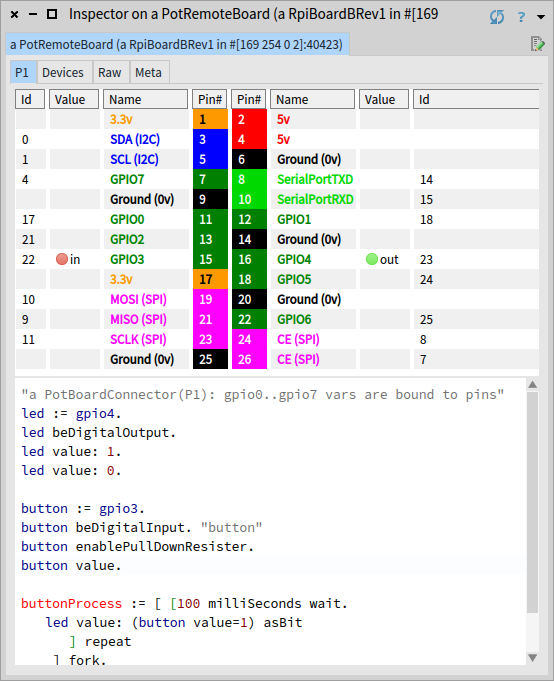
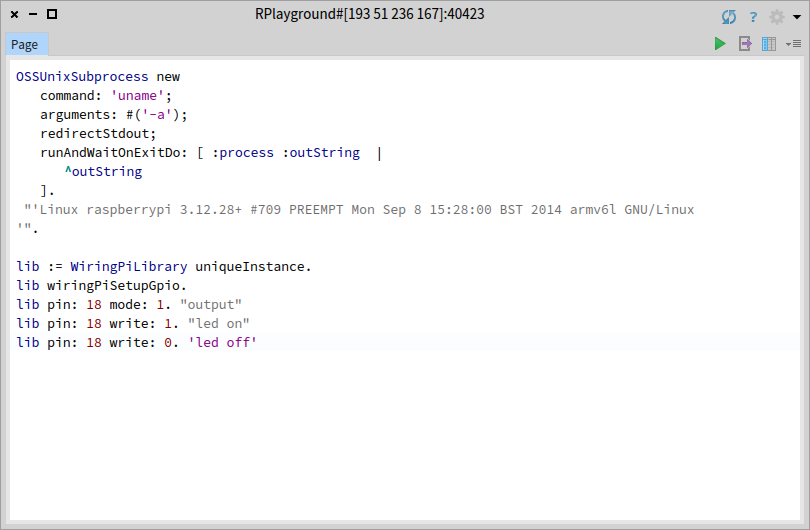

# PharoThings

Live programming platform for IoT projects based on [Pharo](http://pharo.org).
It includes:
- development tools to lively program, explore and debug remote boards ([TelePharo](https://github.com/dionisiydk/TelePharo))
- board modeling library which simplifies board configuration

    - Raspberry driven by [WiringPi library](http://wiringpi.com)
    - Arduino driven by [Firmata](https://github.com/firmata/arduino), soon
    - Beaglebone, soon

## Installation on Raspberry

1) Download Pharo 6 and install server part of PharoThings:
```Smalltalk
Metacello new
  baseline: 'PharoThings';
  repository: 'github://pharo-iot/PharoThings/src';
  load: #(RemoteDevServer Raspberry).
```
At the end save the image.

2) Download ArmVM to run Pharo on your board: http://files.pharo.org/vm/pharo-spur32/linux/armv6/latest.zip.

3) Copy saved image, changes, sources and ArmVM files into your Raspberry (files should be in same directory)

4) Install [WiringPi library](http://wiringpi.com) in Raspberry

If you use the latest desktop version of Raspbian version just skip this step because WiringPi is included. But light Raspbian image is required manual installation.

PharoThings uses WiringPi to control Raspberry pins. You need install it in your board. There is convenient prebuilt package [here](https://github.com/hamishcunningham/wiringpi/tree/master/package/2.13/unstable). Follow [install](https://github.com/hamishcunningham/wiringpi/blob/master/INSTALL) instructions or do it your own way.

5) Start Pharo on Raspberry with server option:
```bash
pharo --headless Server.image  remotePharo --startServerOnPort=40423
```
It will listen remote IDE connections on port 40423.

You can also prepare image with running server. Evaluate following code in playground and save the image:
```Smalltalk
TlpRemoteUIManager registerOnPort: 40423
```
In that case command line option --startServerOnPort is not needed. Just start Pharo with --no-quit option:
```bash
pharo --headless Server.image  --no-quit
```

## Connecting to board
Install client part of PharoThings to development (client) Pharo image:
```Smalltalk
Metacello new
  baseline: 'PharoThings';
  repository: 'github://pharo-iot/PharoThings/src';
  load: 'RemoteDev'
```
Connect to remote Pharo running on Raspberry from playground:
```Smalltalk
remotePharo := TlpRemoteIDE connectTo: (TCPAddress ip: #[193 51 236 167] port: 40423)
```
Notice that you should know IP address of your Raspberry and port where running Pharo is waiting for remote IDE connection. In this example we used port 40423.

Now inspect the board:
```Smalltalk
remoteBoard := remotePharo evaluate: [ RpiBoardBRev1 current].
remoteBoard inspect
```


The board inspector provides scheme of pins similar to Raspberry Pi docs.
But here it is a live tool which represents current pins state. 

In picture the board is shown with two configured pins: gpio3 and gpio1 which are connected to physical button and led accordingly.

Digital pins are shown with green/red icons which represent high/low (1/0) values. In case of output pins you are able to click on icon to toggle the value. Icons are updated according to pin value changes. If you click on physical button on your board the inspector will show updated pin state by changing icon color.

The evaluation pane in the bottom of the inspector provides bindings to gpio pins which you can script by #doIt/printIt commands. Example shows expressions which were used to configure button and led.

For led we first introduced named variable #led which we assigned to gpio1 pin instance:
```Smalltalk
led := gpio1
```
Then we configured pin to be in digital output mode and set the value:
```
led beDigitalOutput.
led value: 1
```
It turned the led on.

For button we did the same but with digital in mode and extra resistor configuration:
```Smalltalk
button := gpio3.
button beDigitalInput. "button"
button enablePullDownResister.
```
You can check current value of pin using #value message:
```Smalltalk
led value.
button value
```

You can notice that gpio variables are not numbers which points to pins. PharoThings models boards with first class pins. They are real objects with behaviour. For example to switch digital value you can just ask pin to toggle it:
```
led toggleDigitalValue
```


@TODO

Currently only model B is implemented (with revision 1 and 2). But this code will not break on other boards. In that case pins will point to wrong phisical pins of your board. But tool will show working UI. And you will be able to control board by low level library (like WiringPi) using remote playground:
```Smalltalk
remoteBoard openPlayground
```


By the way modeling specific board is very simple task (will be explained later). 
You are free to support it by yourself and contribute it to this project.


